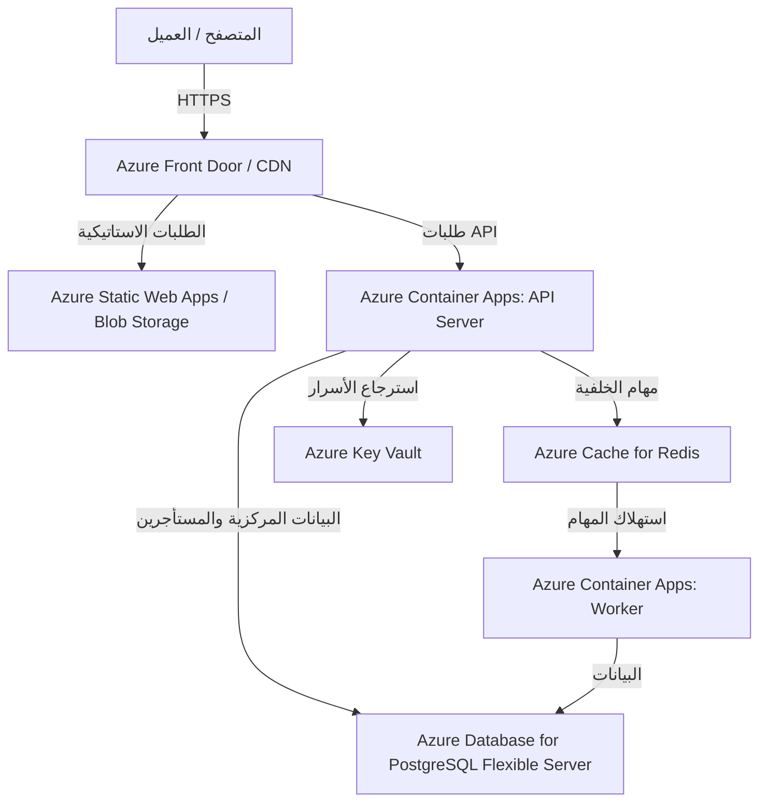

# دليل نشر نظام "سند ذكي" على مايكروسوفت أزور (Azure Deployment Guide)

يركز هذا الدليل على كيفية نشر نظام **سند ذكي (Sanad Thaki)** بنسخته الإنتاجية والمحمية `v15.8` على منصة **Microsoft Azure**.
يوفر النظام بنية متعددة المستأجرين (Multi-Tenant SaaS) تعتمد على قاعدة بيانات لكل مستأجر (Database-per-Tenant) أو قاعدة بيانات مشتركة، وذاكرة مؤقتة Redis، وخدمة خلفية (API Node.js) بجانب عامل خلفي للمهام الطويلة (Worker Node.js).

---

## 🏗️ الخيار الأول: النشر السريع المتوافق باستخدام Azure VM (Ubuntu) + Docker Compose
هذا الخيار هو الأسرع والأكثر مطابقة للبيئة الحالية على AWS، حيث يعتمد بالكامل على الحاويات المهيأة مسبقاً في `docker-compose.production.yml` وبوابة HTTPS باستخدام Caddy.

### 1. إنشاء خادم Azure VM
1. ادخل إلى بوابة Azure وبادر بإنشاء **Virtual Machine**.
2. **المواصفات الموصى بها:**
   - **نظام التشغيل:** Ubuntu Server 22.04 LTS (x64)
   - **حجم السيرفر:** `Standard_D2s_v5` أو `Standard_B2s` (كحد أدنى 4GB RAM لمطابقة احتياجات Postgres/Redis والمحرك).
3. **إعدادات الشبكة وقواعد الحماية (NSG):**
   - افتح منفذ `22` (SSH) للوصول والتحكم الآمن.
   - افتح منافذ `80` (HTTP) و `443` (HTTPS) لاستقبال طلبات المستخدمين.
   - **تنبيه أمني:** تأكد من إبقاء منافذ قاعدة البيانات `5432` ومحدد المعدل `6379` **مغلقة** تماماً عن الإنترنت الخارجي.

### 2. تثبيت بيئة Docker على السيرفر
اتصل بالسيرفر عبر SSH ونفذ سكربت التثبيت الآلي المرفق مع النظام:
```bash
# تحديث السيرفر وتنزيل الملحقات الأساسية
sudo apt update -y && sudo apt upgrade -y
sudo apt install -y git zip unzip curl

# استخدام سكربت تثبيت Docker المرفق في النظام
chmod +x ops/ec2/install-docker.sh
./ops/ec2/install-docker.sh
```

### 3. إعداد ملف البيئة الإنتاجية `.env.production`
انسخ ملف `.env.production.example` إلى السيرفر كـ `.env.production` وقم بتعبئة القيم الحقيقية:
```bash
cp .env.production.example .env.production
nano .env.production
```
> [!IMPORTANT]
> تأكد من تغيير الأسرار الافتراضية إلى مفاتيح عشوائية آمنة تزيد عن 64 رمزًا:
> - `JWT_SECRET`
> - `REFRESH_TOKEN_SECRET`
> - `REDIS_PASSWORD`
> - `SETUP_BOOTSTRAP_TOKEN` (أكثر من 32 رمزًا)
> - `DATABASE_URL` (قاعدة التحكم المركزية)

### 4. إطلاق النظام وبوابة HTTPS
يقوم النظام باستخدام Caddy للحصول على شهادة SSL مجانية وتلقائية من Let's Encrypt وتمرير الطلبات بأمان.
```bash
# 1. تفعيل ترحيلات قاعدة البيانات
docker compose -f docker-compose.production.yml run --rm api node scripts/migrate-db.mjs

# 2. تشغيل فحص ما قبل الإطلاق للتأكد من المعايير الأمنية والمستندات
docker compose -f docker-compose.production.yml run --rm api node scripts/production-preflight.mjs

# 3. تشغيل كافة الخدمات (API, Worker, Postgres, Redis, Caddy)
docker compose -f docker-compose.production.yml up -d
```
للتحقق من الجاهزية التشغيلية، افتح المسار المخصص للفحص:
```bash
curl -I https://<YOUR_APP_DOMAIN>/health/ready
```

---

## 🐳 الخيار الثاني: البنية الإنتاجية المدارة بالكامل (Azure Managed Enterprise Stack)
للحصول على أعلى مستويات الاستقرار، والتوسع التلقائي (Auto-scaling)، وفصل المهام، يوصى بالاعتماد على الخدمات المدارة من Azure كالتالي:



### 1. قاعدة البيانات: Azure Database for PostgreSQL (Flexible Server)
بدلاً من تشغيل PostgreSQL داخل حاوية، نعتمد على سيرفر مدار:
- **الإصدار:** PostgreSQL 16.
- **إعداد الشبكة:** يجب تمكين **Private Access (VNet Integration)** لضمان عدم إمكانية الوصول لقاعدة البيانات إلا من داخل الشبكة الافتراضية الخاصة بالنظام.
- **التكوينات:**
  - `DATABASE_URL` ستشير إلى رابط السيرفر المدار: `postgres://<user>:<password>@<azure-postgres-host>:5432/postgres?sslmode=require`

### 2. الذاكرة المؤقتة ومحددات المعدل: Azure Cache for Redis
- تفعيل **Azure Cache for Redis** (إصدار 7 فأعلى) لتنسيق محددات المعدلات (Rate Limiting) وإدارة طوابير المهام.
- تحديث المتغيرات:
  - `REDIS_URL=rediss://:<primary-key>@<cache-name>.redis.cache.windows.net:6380` (لاحظ استخدام البروتوكول الآمن `rediss` والمنفذ `6380`).

### 3. استضافة الخدمات الخلفية: Azure Container Apps (ACA)
تعتبر Container Apps أفضل بيئة لتشغيل الحاويات الإنتاجية بدون تعقيدات Kubernetes:
1. **حاوية API (`api`):**
   - **صورة الحاوية:** تُبنى من `apps/api/Dockerfile`.
   - **المنفذ المستهدف:** `3000`.
   - **Ingress:** تمكين Ingress الخارجي (External) لاستقبال حركة المرور.
   - **المتغيرات:** `WORKER_ONLY=false`, `DISABLE_INVOICE_QUEUE_WORKER=true`.
2. **حاوية العامل (`worker`):**
   - **صورة الحاوية:** نفس صورة API.
   - **Ingress:** معطل (لا تحتاج لاستقبال طلبات خارجية).
   - **المتغيرات:** `WORKER_ONLY=true`, `DISABLE_INVOICE_QUEUE_WORKER=false`.

### 4. استضافة الواجهة الأمامية: Azure Static Web Apps (SWA)
يتم بناء الواجهة الأمامية المستقلة (Vite + React) كأصول استاتيكية ونشرها مباشرة للـ CDN العالمي لأزور لسرعة فائقة:
```bash
cd apps/frontend
npm install
npm run build
```
- قم برفع مجلد الـ `dist` الناتج إلى **Azure Static Web Apps** أو **Azure Blob Storage** مع تفعيل Static website hosting وربطه بـ **Azure CDN** أو **Azure Front Door**.

---

## 🔒 حماية أسرار المستأجرين: الانتقال إلى Azure Key Vault
في بيئة AWS، يدعم النظام `aws` كـ `SECRETS_PROVIDER` لحفظ مفاتيح التشفير والمصادقة الخاصة بكل مستأجر بشكل معزول في AWS Secrets Manager.
عند الانتقال لـ Azure، يوفر النظام خيارين:
1. **الخيار المحلي الآمن:** استخدام محرك `local` المشفر لحفظ الأسرار في مجلد معزول مدعوم بـ Volume مستمر (Persistent Azure Files Share) عبر ضبط:
   - `SECRETS_PROVIDER=local`
   - `LOCAL_TENANT_SECRET_DIR=/data/tenant-secrets`
2. **التكامل المباشر مع Azure Key Vault (تطوير اختياري):**
   يمكن ربط النظام بـ Azure Key Vault عبر تعديل كود تزويد الأسرار في `apps/api/src/tenant-crypto.js` لاستخدام الحزمة `@azure/keyvault-secrets` بدلاً من AWS.

---

## 🚀 خطة النشر والتحقق التلقائي (CI/CD Pipeline)

لأتمتة النشر الآمن من خلال GitHub Actions إلى Azure VM، أضف هذا السير العمل إلى `.github/workflows/deploy-production-azure.yml`:

```yaml
name: Deploy Production to Azure VM

on:
  push:
    tags:
      - 'v*' # التشغيل التلقائي عند إصدار نسخة برقم إصدار (مثال v15.8.0)

jobs:
  validate-and-deploy:
    runs-on: ubuntu-latest
    steps:
      - name: Checkout Code
        uses: actions/checkout@v4

      - name: Setup Node.js
        uses: actions/setup-node@v4
        with:
          node-version: 20
          cache: 'npm'
          cache-dependency-path: apps/api/package-lock.json

      - name: Run Security and Unit Tests
        run: |
          cd apps/api
          npm ci
          npm run test:unit

      - name: Deploy via SSH to Azure VM
        uses: appleboy/ssh-action@master
        with:
          host: ${{ secrets.AZURE_VM_IP }}
          username: ${{ secrets.AZURE_VM_USER }}
          key: ${{ secrets.AZURE_SSH_PRIVATE_KEY }}
          script: |
            cd /opt/sanad-thaki/current
            git fetch --all --tags
            git checkout ${{ github.ref_name }}
            
            # نسخ ملف البيئة الآمن المخزن بالسيرفر
            cp /opt/sanad-thaki/shared/.env.production .env
            
            # إعادة بناء وتشغيل الحاويات
            docker compose -f docker-compose.production.yml pull
            docker compose -f docker-compose.production.yml run --rm api node scripts/migrate-db.mjs
            docker compose -f docker-compose.production.yml run --rm api node scripts/production-preflight.mjs
            docker compose -f docker-compose.production.yml up -d --build
```

---

## 📈 الفحوصات التشغيلية والتحقق الأمني بعد النشر (Post-Deployment Audit)

قبل فتح المنصة للاستخدام العام، نفذ السكربتات التالية داخل الحاوية للتأكد من سلامة العزل والتوزيع:

1. **فحص الاستقرار والجاهزية:**
   ```bash
   docker compose -f docker-compose.production.yml exec api node scripts/production-preflight.mjs
   ```
2. **فحص حماية عزل المستأجرين وقواعد البيانات:**
   ```bash
   docker compose -f docker-compose.production.yml exec api node scripts/production-db-per-tenant-acceptance.mjs
   ```
3. **فحص تكامل العمليات والتحقق البنكي والربط:**
   ```bash
   docker compose -f docker-compose.production.yml exec api node scripts/live-production-acceptance.mjs
   ```

> [!CAUTION]
> تأكد دائماً أن إعداد `ALLOW_DEMO_LOGIN` في ملف `.env.production` مضبوط على `false` لمنع أي تسجيل دخول تجريبي أو تسريب لبيانات التحكم في البيئة الحية.
